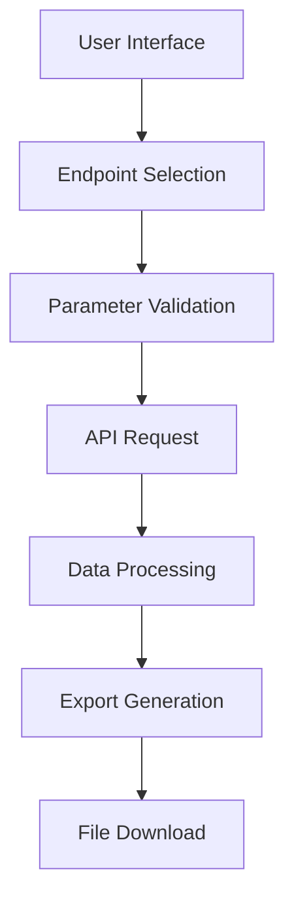

# 3CX XAPI PHP Automation Toolkit

After experimenting with 3CX XAPI via Postman and PowerShell, I developed this PHP solution to automate API interactions with comprehensive data handling capabilities.

Note (2025-03-27): While much of the PHP project is done, it still needs polish, and some endpoints won't work. It is still great as a proof of concept and an example how-to!

## Key Features

- **Auto-discovery System**  
  - Dynamically generates endpoint definitions from PBX Swagger specs
  - Self-updating configuration when APIs change (configurable refresh interval)

- **Intelligent Data Processing**  
  - Automatic datetime/duration formatting (localized support)
  - Pagination handling with `$top`/`$skip` parameters
  - Smart field visibility based on endpoint requirements

- **Enterprise-grade Export**  
  - CSV and Excel (XLSX) output with proper encoding
  - Memory-efficient streaming for large datasets
  - Built-in download handler with cleanup

- **Security Focused**  
  - Secure session management
  - Input sanitization
  - Credential protection

## System Architecture

## Included Files

| File | Description |
|------|-------------|
| `composer.json` | PHP dependencies for Excel export |
| `config.php` | Stores your PBX URL, credentials, and settings |
| `index.php` | Main UI for selecting endpoints and setting parameters |
| `generate_definitions.php` | Parses `swagger.yaml` and auto-generates `definitions.php` |
| `definitions.php` | Holds arrays with endpoint names, parameters, and response schemas |
| `functions.php` | All helper functions for auth, API calls, parsing, formatting, exporting |
| `export.php` | Handles form input, calls functions, and generates export files |
| `download.php` | Streams exported file to browser |

Consult separate readme file `functions-readme.md` for details about functions in `functions.php` file.

Note: Files `swagger.yaml`, `swagger.json` and `definitions.php` will be created on first run!

## Installation & Setup

### Requirements
- PHP 8.0+ with these extensions:
  - curl, json, intl, fileinfo, gd, mbstring, zip
- Node.js 16+ (for Swagger conversion)
- Composer (for PHP dependencies)

### Setup Process
1. **Install Dependencies**:
   - Node.js package: `yamljs` (global install)
   - PHP libraries: `phpoffice/phpspreadsheet` via Composer

2. **File Permissions**:
   - `config.php` should be read-only
   - Temp directory needs write permissions

3. **Configuration**:
   - Edit `config.php` with your PBX details:
     - API URL and credentials
     - Debug/SSL settings
   - Ensure `SWAGGER_AGE_LIMIT` matches your update frequency needs

4. **Security**:
   - Place `config.php` outside web root if possible
   - Configure PBX IP whitelisting for your server IP

### First Run
1. Access `index.php` in your browser
2. System will auto-generate:
   - API definitions from your PBX
   - Required PHP definitions files
3. Select an endpoint and test export functionality

> **Note**: The system requires network access to your PBX, setup your routes and firewall rules accordingly

---

## How It Works

1. **Authentication & Definition Generation**  
   - Retrieves token from PBX using credentials in `config.php`  
   - Downloads `swagger.yaml` from PBX  
   - Converts it to `swagger.json` via `yaml2json` (Node.js utility)  
   - `generate_definitions.php` parses it to create `definitions.php`  

2. **User Interface (index.php)**  
   - Dynamically builds dropdown of available endpoints from `definitions.php`  
   - Allows date range, pagination (`top`, `skip`), and ID input  
   - Submits data to `export.php`  

3. **Data Processing (export.php + functions.php)**  
   - Validates and sanitizes input  
   - Retrieves access token  
   - Calls endpoint using data from `definitions.php`  
   - Parses JSON response, handles warnings/messages  
   - Expands dataset (formats datetimes, durations, etc.)  
   - Displays sample output and exports to CSV/XLSX  

4. **Download (download.php)**  
   - Streams the generated file to the user's browser  

---

## Output Examples

- Handles both flat and nested `@odata`-style responses  
- Formats dates and durations into user-friendly columns  
- Debug mode shows raw HTTP codes, messages, and full response data  

---

## Debugging Tips

- Enable debug mode in `config.php` to get verbose output  
- Use small `top` values while debugging to avoid massive dumps  

---

## Caveats & Limitations

- **Only `GET` endpoints** are used to avoid making dangerous changes via `PUT/POST/DELETE`  
- Skips `Pbx.Download*` endpoints – equivalents exist in the export functionality  
- Some endpoints like `MyUser`, `MyGroup` return `403` – likely due to permission limitations of the API credentials  
- A few endpoints are skipped due to requiring obscure or undocumented parameters (they are commented out in `definitions.php`)  
- Input validation is minimal for now – the plan is to leverage `definitions.php` further to improve this  

---

## Status

Out of ~100+ endpoints, **about 95% work flawlessly**. Some may return no data depending on your PBX configuration. The goal is to continue refining the generator so the rest of the code remains universal and clean.  

---

## Contributions & Issues

If you run into issues, have suggestions, or want to contribute fixes – feel free to [open an issue](https://github.com/luxzg/3CX-XAPI_examples/issues). It might help others too!  

---

## Final Thoughts

This is still a work in progress, but already a very usable proof of concept. I’ll keep polishing it and updating the definitions logic to make everything more robust and universal. Stay tuned!  
